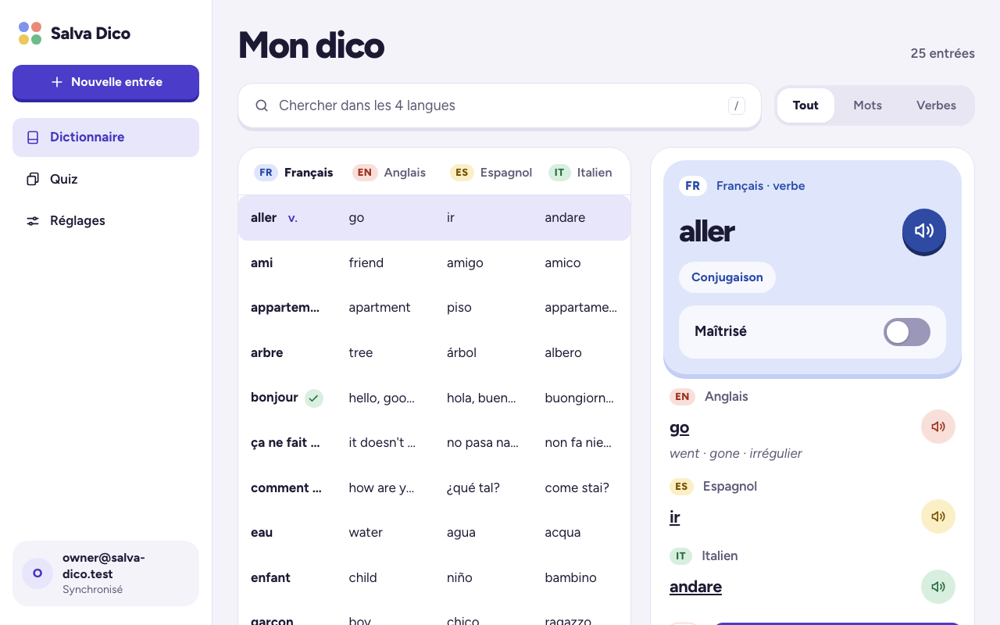
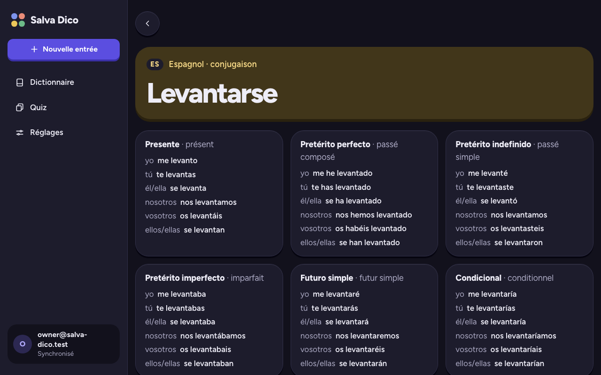
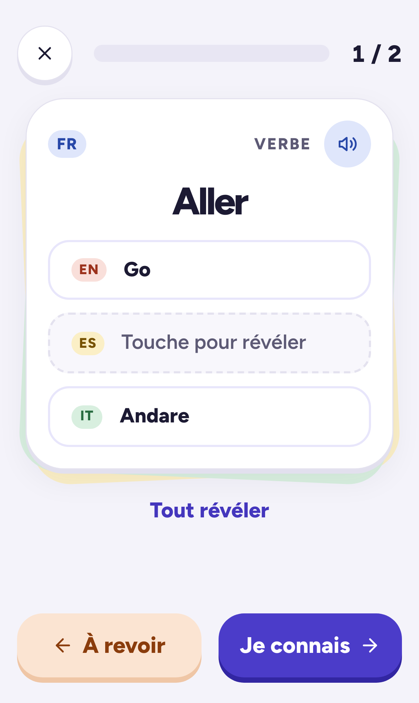
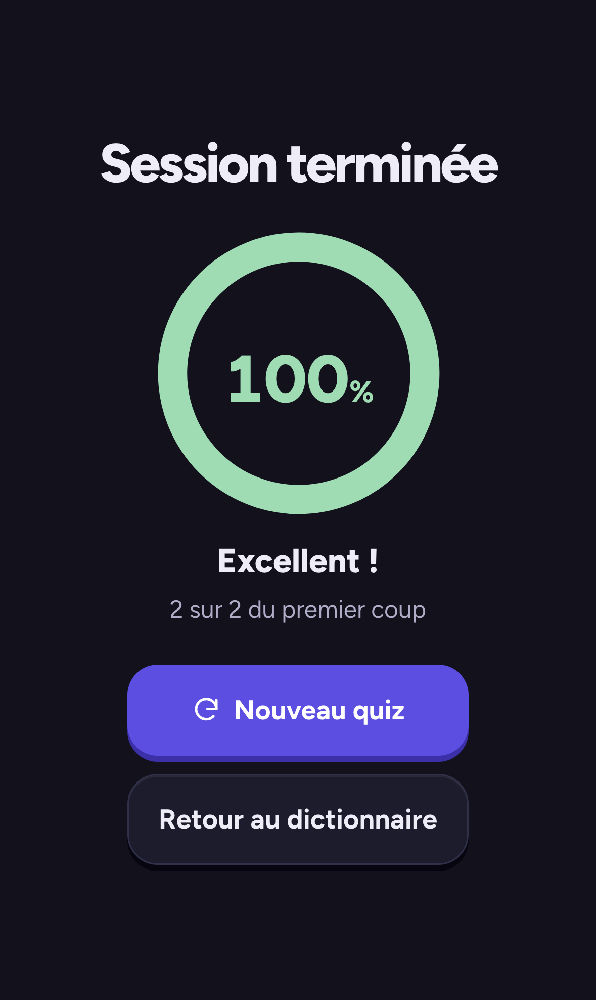
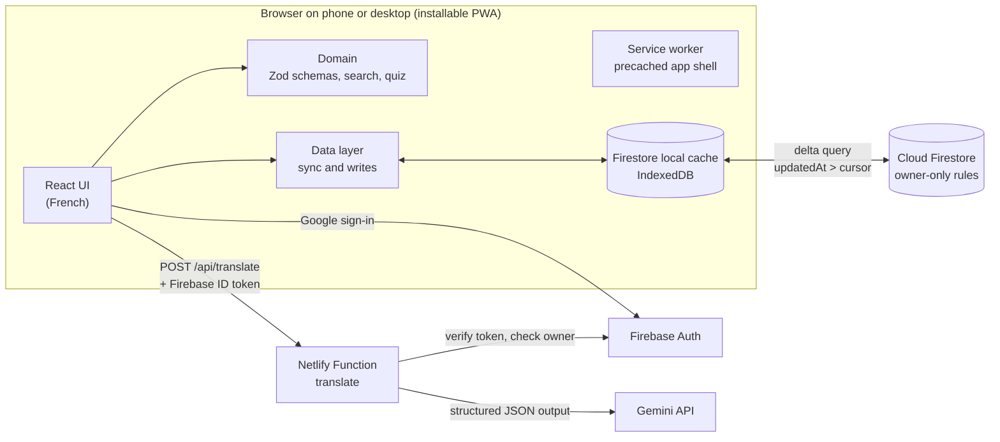

# Salva Dico

A personal, offline-first PWA to build a **four-language vocabulary dictionary**
(French, English, Spanish, Italian) and review it with a swipe quiz. Every entry exists in the four
languages at once, because the goal is to learn them together.

I use it every day on my phone and on desktop. It is also a portfolio project: the code, the
security model, the tests and the CI matter as much as the features.

<p>
  
</p>
<p>
  
  
  
</p>

## Features

- **Dictionary in four languages:** a word (or expression), or a verb with its full conjugation in
  French, Spanish (Spain) and Italian, plus the English past forms.
- **Search** across the four languages at once, insensitive to case, accents, articles and verb
  markers (`to go`, `se lever`, `levantarse`), ranked exact > prefix > word prefix > substring.
- **AI-assisted entries:** type a word in any language, Google Gemini fills in the other three
  languages and the conjugations, and everything is reviewed and editable before saving.
- **Swipe quiz:** touch, mouse and keyboard; cards to review come back once at the end; animated
  score.
- **Offline first:** reading, searching, adding, editing and the quiz all work without network;
  changes sync between devices when it comes back.
- **Text-to-speech** per translation, **JSON export / import** with a preview, light and dark
  themes following the system.

## Architecture



| Layer           | Where                                     | Notes                                                                  |
| --------------- | ----------------------------------------- | ---------------------------------------------------------------------- |
| Domain (pure)   | `src/domain/`                             | Zod schemas (source of truth), search, duplicates, quiz, export format |
| Data (Firebase) | `src/data/`                               | Delta sync, writes, Firestore ↔ domain conversion                      |
| UI              | `src/features/`, `src/components/`        | One folder per screen; all UI strings in `src/i18n/fr.ts`              |
| AI function     | `server/translate/`, `netlify/functions/` | Framework-free handler, unit-tested with a mocked Gemini client        |
| Security rules  | `firestore.rules`                         | Tested on the emulator                                                 |

| Concern         | Choice                                                             |
| --------------- | ------------------------------------------------------------------ |
| UI              | React 19 + TypeScript (strict), plain CSS with custom properties   |
| Build / PWA     | Vite, `vite-plugin-pwa` (Workbox)                                  |
| Routing         | React Router (data router)                                         |
| Auth / database | Firebase Authentication (Google), Cloud Firestore                  |
| AI              | Google Gemini API, via a Netlify Function                          |
| Validation      | Zod, shared by the client, the function and the import             |
| Tests           | Vitest + Testing Library, Playwright, axe-core, Firebase emulators |
| Quality         | ESLint (type-aware), Prettier, GitHub Actions CI                   |
| Package manager | pnpm, with supply-chain hardening                                  |

## Security model

It is a single-user app on a public repository: the threat model is "anyone can read the code and
call the backend".

- **Authorization lives in the Firestore rules** (`firestore.rules`), not in the client. Only the
  owner's UID can read or write, and only under `users/{uid}/entries`. Rules also validate the
  document structure, force `updatedAt` to the server time, keep `createdAt` immutable and forbid
  hard deletes. Any other account gets an "access denied" screen.
- **The Firebase web config is public by design.** Every `VITE_` variable ends up in the bundle; the
  API key only identifies the project. The owner UID is a literal in the rules: not a secret, and
  rules cannot read environment variables.
- **The Gemini API key never reaches the client.** It only lives in the Netlify environment. The
  function verifies the Firebase ID token and checks the owner UID **before**
  calling Gemini, so nobody else can spend the quota. The token is verified with `jose`, as Firebase
  documents for third-party JWT libraries (Google's public keys, RS256, audience, issuer, expiry,
  auth time): lighter than `firebase-admin`, whose dependencies did not load on Netlify. Its answers are validated with the same Zod
  schemas as the entries, and errors are mapped to a fixed list of codes (no internal details leak).
  The function is **rate limited** per IP (Netlify code-based rule), and refuses to start if
  `FIREBASE_AUTH_EMULATOR_HOST` is set for a real project: that mode accepts the unsigned tokens of
  the Auth emulator, and the owner UID is public.
- **API keys are restricted in Google Cloud:** the public Firebase key only to the Firebase APIs
  and the site's referrers (never the Gemini API, which an unrestricted key in the same project
  could call), the Gemini key only to the Gemini API.
- **Content-Security-Policy** (`csp.ts`): strict policy injected at build time, without
  `unsafe-inline` or `unsafe-eval`. E2E tests fail on any CSP violation.
- **HTTP headers** (`netlify.toml`): HSTS, `nosniff`, `Referrer-Policy`, `Permissions-Policy`,
  `X-Frame-Options`.
- **Supply chain** (`pnpm-workspace.yaml`): only versions published at least 7 days ago,
  `trustPolicy: no-downgrade`, no git or tarball sub-dependencies, no install script unless
  reviewed. GitHub Actions are pinned to commit SHAs and the CI token is read-only. `pnpm audit`
  findings are reviewed: a vulnerable `@grpc/grpc-js` pinned by Firestore (Node only) is overridden.
  `pnpm audit --prod` reports no known vulnerability.

## Offline and sync strategy

Firestore's free tier allows 50,000 document reads per day, and the dictionary will hold thousands of
entries. Re-listening to the whole collection on every app start would burn that quota, so the sync
is **delta-based** (`src/data/entriesSync.ts`), with two listeners:

1. A **cache-only listener** on the whole collection is the single source of the entries. It reads
   Firestore's persistent local cache (IndexedDB): free, instant, offline. It also sees local writes
   at once, including offline ones.
2. A **server listener** only on documents whose **server** `updatedAt` is after a stored cursor.
   It feeds the local cache. An app start with no remote change costs one read instead of one per
   entry.

Details and safeguards:

- `updatedAt` is always a server timestamp (enforced by the rules), so a wrong device clock cannot
  hide a change. The cursor keeps nanosecond precision and only advances on server-confirmed data.
- **Deletions are soft** (`deleted: true`) so they travel through the delta query.
- Offline writes are applied to the local cache immediately and queued by Firestore.
- Why two listeners: a pending server timestamp does not match `updatedAt > cursor` locally, so a
  single delta listener would hide offline writes until reconnection. The offline E2E test found
  this; an emulator test now reproduces it.
- The cache must never evict synced entries: cache garbage collection is disabled and the app asks
  for persistent storage. If the cache is empty while a cursor exists (site data cleared), the app
  falls back to a full sync.
- The service worker precaches the app shell; the AI button is disabled offline (no queued AI
  requests).

## AI design

The function (`server/translate/`) asks Gemini for **structured JSON output** with a schema derived
from the Zod schemas (`z.toJSONSchema`), then validates the answer with Zod again.

- **The prompt** enforces Spain Spanish (vosotros), American English, the exact tenses of the data
  model, compound pasts with agreement, no literary tenses, and dictionary forms (no article).
- **Verbs are generated in several requests**: the entry first, then one request per conjugation,
  in parallel. Asking for three full conjugation tables at once trips Gemini's recitation filter
  (empty answer).
- **Resilience**: retries on overload or blocked answers, then **fallback models**
  (`GEMINI_MODEL` is a comma-separated list). Each attempt has its own 25 s limit, so a model
  that does not answer is left for the next one instead of using up the overall 50 s limit
  (under Netlify's 60 s).
- Errors are shown in French in the app, without losing what was typed. Nothing is saved before the
  review screen is validated.

## Testing strategy

| Level          | Tool                                                  | What it covers                                                                                        |
| -------------- | ----------------------------------------------------- | ----------------------------------------------------------------------------------------------------- |
| Unit           | Vitest                                                | Schemas, search, duplicates, quiz reducer, export format, voice selection, AI handler (mocked Gemini) |
| Component      | Vitest + Testing Library                              | Every screen: forms, validation, quiz controls, import preview, focus management                      |
| Rules and sync | Firebase emulator + `rules-unit-testing`              | Owner-only access, structural validation, delta sync, offline writes, import                          |
| End to end     | Playwright (Chromium, Firefox, WebKit, Pixel, iPhone) | Real production build with service worker and CSP, on seeded emulators                                |
| Offline        | Playwright                                            | Offline reload, search, add, master, quiz, then sync to a second device                               |
| Accessibility  | `@axe-core/playwright`                                | WCAG 2.2 AA on every screen, light and dark themes                                                    |

CI (GitHub Actions) runs three jobs on every push and pull request: typecheck, lint, format, unit
tests and build; the emulator tests; the E2E tests.

## Getting started

Requirements: Node.js 24 LTS (see `.nvmrc`), pnpm (version pinned in `package.json`) and, for the
Firebase emulators, Java 21.

```sh
pnpm install
pnpm exec playwright install   # browsers for E2E tests, first time only
```

**Local development without touching real data** (recommended): runs the app against the Firebase
emulators, seeded with ~25 realistic entries. Use the "Connexion de dev (émulateur)" button.

```sh
pnpm dev:emulators             # app on http://localhost:5173, emulator UI on http://localhost:4000
```

The AI also works locally: put `GEMINI_API_KEY` and `OWNER_UID` in `.env.local` (see
`.env.example`); the Vite dev server serves the function on `/api/translate`.

To seed thousands of synthetic entries for performance checks:
`firebase emulators:exec --only firestore,auth --project demo-salva-dico --ui 'node scripts/seed-emulator.ts --bulk 3000 && vite --mode emulator'`.

**Against the real Firebase project:** copy `.env.example` to `.env.local`, fill in the web config,
then run `pnpm dev`.

## Scripts

| Command                 | Description                                                             |
| ----------------------- | ----------------------------------------------------------------------- |
| `pnpm dev`              | Start the dev server                                                    |
| `pnpm dev:emulators`    | Dev server on seeded Firebase emulators                                 |
| `pnpm build`            | Typecheck and build for production                                      |
| `pnpm preview`          | Serve the production build locally                                      |
| `pnpm typecheck`        | Run the TypeScript compiler                                             |
| `pnpm lint`             | Lint with ESLint                                                        |
| `pnpm format`           | Format with Prettier (`format:check` to verify only)                    |
| `pnpm test`             | Unit and component tests (Vitest)                                       |
| `pnpm test:emulator`    | Security rules and sync tests on the Firestore emulator (needs Java 21) |
| `pnpm test:e2e`         | E2E, offline and accessibility tests (Playwright, on seeded emulators)  |
| `pnpm docs:screenshots` | Regenerate the README screenshots from the demo data                    |
| `pnpm emulators`        | Start the Firebase emulators with their UI on port 4000                 |

## Deployment (Netlify)

1. Create the site from the repository: `netlify.toml` sets the build, the functions and the headers.
2. Set the environment variables (see `.env.example`):
   - `VITE_FIREBASE_*`: the Firebase web config, with `VITE_FIREBASE_AUTH_DOMAIN` set to the site's
     own domain (sign-in goes through the `/__/auth` proxy of `netlify.toml`);
   - `OWNER_UID`, `GEMINI_API_KEY`, and optionally `GEMINI_MODEL` (comma-separated fallback list).
3. In the Firebase console, add the site's domain to the Auth authorized domains.
4. In the Google Cloud console (APIs & Services > Credentials), edit the OAuth web client
   auto-created by Firebase: add `https://<site>` to the authorized JavaScript origins and
   `https://<site>/__/auth/handler` to the authorized redirect URIs. Without it, Google sign-in
   fails with `Error 400: redirect_uri_mismatch`.
5. Deploy the rules: `pnpm exec firebase deploy --only firestore`.

Expected console noise in production: Netlify injects its own badge script, which builds an
`about:srcdoc` iframe. That iframe inherits the app's Content-Security-Policy, so its inline script
and style are blocked. It does not affect the app; turn the badge off in the Netlify project
settings rather than loosening the CSP.

## Decisions and trade-offs

- **Only two entry types (word, verb).** Grammar details (gender, articles, plurals, adjective forms)
  were dropped to keep daily input fast; only verbs carry extra data.
- **Single user, no backend of my own.** Firestore rules are the authorization layer; the only
  server code is the AI function, which must hide the API key.
- **No UI framework, no state library.** Plain CSS with custom properties, React context and pure
  domain functions are enough at this size, and keep the bundle small.
- **Swipe without a gesture library:** Pointer Events give touch and mouse in one code path.
- **Tombstones are never purged** yet: a purge can be added if the collection grows too much.

## License

[MIT](LICENSE)
